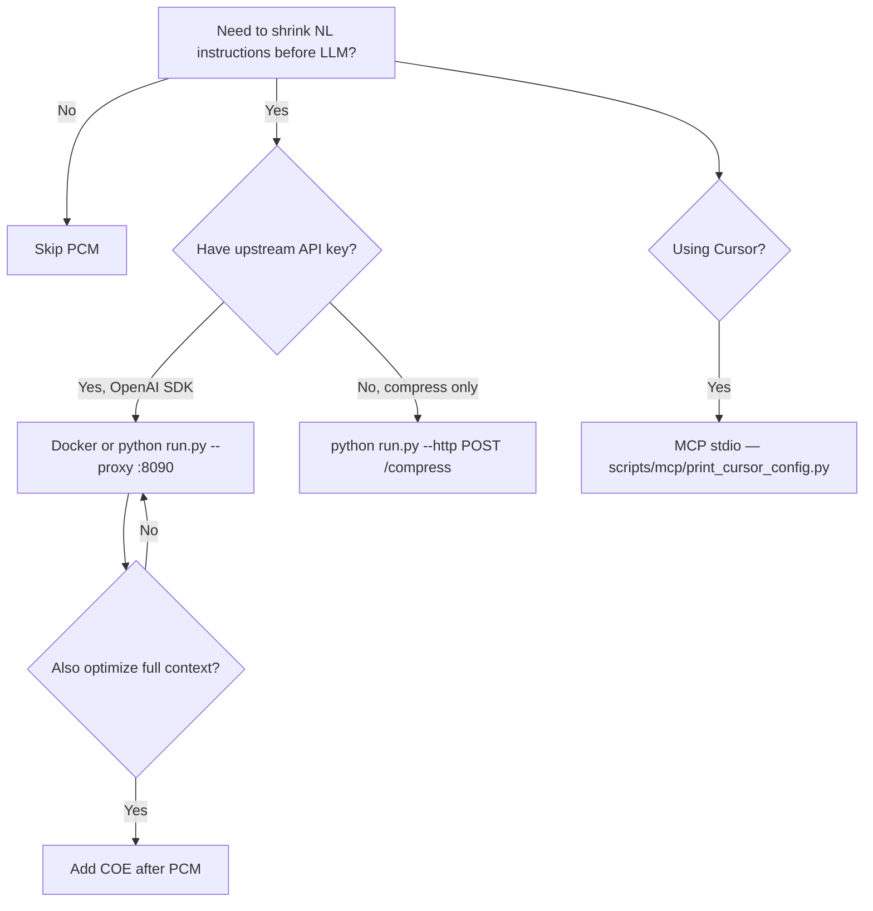

# Prompt Compression Middleware (PCM)

[](https://www.python.org/downloads/)
[](CHANGELOG.md)
[](LICENSE)
[](scripts/ci-local.sh)

Compress **natural-language instructions** into compact **PCM** format (`TASK=review INPUT=python…`) before they reach your upstream LLM. Code blocks, documents, and other payloads pass through **unchanged**.

```
Client → PCM Proxy (:8090) → Mistral / OpenAI-compatible API
              ↓
         Ollama (local compressor: granite4.1:3b | pcm-granite)
```

Pair with [**Context Optimization Engine (COE)**](https://github.com/ntnglz/Context-Optimization-Engine) for full context optimization:

`User → PCM (instruction) → COE (context) → LLM`

## Try it now

**Fastest (no Ollama, no API key):**

```bash
git clone https://github.com/ntnglz/Prompt-Compression-Middleware.git
cd Prompt-Compression-Middleware
pip install -e ".[dev]"
python run.py --demo-stub
```

**Production-shaped (Docker + upstream):**

```bash
cp .env.example .env   # set MISTRAL_API_KEY
docker compose up --build
curl http://localhost:8090/health
```

Proxy endpoint: `http://localhost:8090/v1/chat/completions`

## Before / after

Same example as `python run.py --demo-stub` and [`data/examples/`](data/examples/README.md).

**Before** (instruction in natural language):

```text
Review this Python code carefully for race conditions, memory leaks,
and optimization opportunities. Return a Markdown report ordered by severity.
```

**After** (PCM instruction — payload below stays verbatim):

```text
TASK=review INPUT=python CHECK=race,leak,perf FORMAT=markdown ORDER=severity
```

The fenced Python block in [`proxy_chat.json`](data/examples/proxy_chat.json) is never rewritten by PCM.

## Integration paths

| Path | Command / endpoint | Best for |
|------|-------------------|----------|
| **Docker proxy** | `docker compose up` → `:8090` | Production-like try, team onboarding |
| **Local proxy** | `python run.py --proxy` | Dev with real upstream |
| **REST API** | `python run.py --http` → `POST /compress` | Compress only, no LLM call |
| **MCP (stdio)** | `python run.py --stdio` | Cursor / Claude Desktop |
| **MCP (HTTP)** | `python run.py --mcp-http` → `:8001/mcp` | Remote MCP clients |

See [Getting started](docs/getting-started.md) for install matrix and copy-paste snippets.

## When not to use PCM

- **Short prompts** — below `PCM_MIN_INSTRUCTION_TOKENS` (default 12) are skipped.
- **Already in PCM** — messages starting with `TASK=` are left as-is.
- **No upstream LLM** — use `POST /compress` or MCP if you only need compression.
- **No Ollama** — use `--demo-stub` to explore; real compression needs a local compressor model.
- **Full context / memory optimization** — use [COE](https://github.com/ntnglz/Context-Optimization-Engine/blob/master/docs/getting-started.md), not PCM alone.

## Decision guide



## Response headers (`X-PCM-*`)

| Header | Meaning |
|--------|---------|
| `X-PCM-Messages-Compressed` | Messages compressed in the request |
| `X-PCM-Compression-Ratio` | Token savings ratio (0 if skipped) |
| `X-PCM-Tokens-Saved` | Input tokens saved |
| `X-PCM-Compression-Time-Ms` | Ollama compression time |
| `X-PCM-Upstream-Provider` | mistral, openai, … |
| `X-PCM-Upstream-Model` | Model forwarded upstream |

Skip compression per request: `x-pcm-disable: true`

## Quick commands

```bash
pip install -e ".[dev]"          # import pcm without PYTHONPATH
python run.py --demo-stub        # canonical example, no Ollama
python run.py --quickstart       # demo + OpenAI SDK snippet
python run.py --proxy            # :8090
./scripts/ci-local.sh            # fast tests, no Ollama
python scripts/mcp/print_cursor_config.py
```

## Docs

| Doc | Audience |
|-----|----------|
| [Getting started](docs/getting-started.md) | Install, Docker, proxy, REST, MCP, SDK |
| [FAQ](docs/FAQ.md) | Common questions |
| [Examples](data/examples/README.md) | Canonical JSON bodies |
| [STATUS](docs/STATUS.md) | Maintainer experiment status (ES) |
| [CHANGELOG](CHANGELOG.md) | Releases |

**Spanish (legacy):** [docs/es/](docs/es/README.md)

## Maintainers

Fine-tuning, benchmarks, and experiment write-ups (Spanish):

- [Experiment conclusions](docs/experimento-pcm-conclusiones.md)
- [Granite cloud fine-tune](docs/fase3b-granite-cloud.md)
- [MLX fine-tune (Mac)](docs/fase3-finetuning.md)

```bash
python run.py --help-all
python scripts/validate_granite_v2.py --semantic --e2e
```

## License

Research prototype — use at your own risk.
